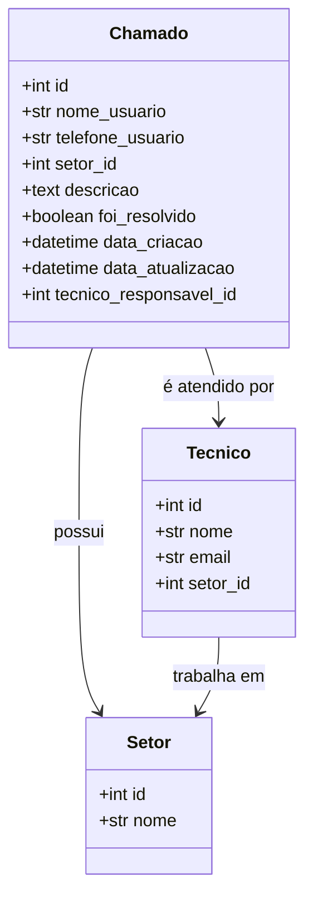

# Sistema de Chamados

## Escopo do sistema:

Sistema de chamados onde o usuário pode criar, listar, atualizar e deletar chamados. No presente sistema, o usuário deverá poder:

- Criar chamados;
- Listar chamados;
- Atalizar chamados;
- Deletar chamados;
- Atribuir nome, telefone e descrição ao chamado;
- Checar se o chamado foi resolvido ou não;
- Ver a data e hora que o chamado foi criado;
- Ver a data e hora que o chamado foi alterado;
- Visualizar o técnico responsável pelo atendimento.

## Diagrama de Classes

## URL's da aplicação

A aplicação será elaborada com base em Class Based Views, seguindo as seguintes URL's:

- '/chamados': listagem de chamados (ListView)
- '/chamados/novo': criação de chamados (CreateView)
- '/chamados/{id}': detalhamento de chamado (DetailView)
- '/chamados/{id}/alterar': alterar chamado (UpdateView)
- '/chamados/{id}/deletar': deletar chamado (DeleteView)
- '/setores': listagem de setores (ListView)
- '/setores/novo': criação de setores (CreateView)
- '/setores/{id}': detalhamento de setor (DetailView)
- '/setores/{id}/alterar': alterar setor (UpdateView)
- '/setores/{id}/deletar': deletar setor (DeleteView)

## Tecnologias Utilizadas

- Python 3.13.5
- Django 5.2.5
- SQLite